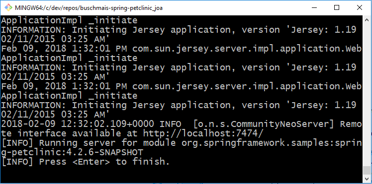

# REFUCTORED Spring PetClinic Sample Application 
see https://github.com/buschmais/spring-petclinic for the forked version of the original

[](https://travis-ci.org/JavaOnAutobahn/spring-petclinic)


# Prerequisites

## Minimum requirements
* Oracle Java Development Kit with Version >=8 ([download](http://www.oracle.com/technetwork/java/javase/downloads/jdk8-downloads-2133151.html))
* Git ([download](https://git-scm.com/downloads))

## Optional
* To produce nicely looking diagrams, install GraphViz ([download](https://www.graphviz.org/download/))

# Installing and getting to know the sample application
Hint: Preferable, you use the Git bash command line or any Unix-like shell for these tasks.

For our use case, we take an sample application of the Spring Framework. Basica

## Understanding the Spring Petclinic application with a few diagrams
<a href="https://speakerdeck.com/michaelisvy/spring-petclinic-sample-application">See the presentation here on SpeakerDeck</a>

## Running the `petclinic` web application
```
	git clone https://github.com/JavaOnAutobahn/spring-petclinic.git
	cd spring-petclinic
	./mvnw tomcat7:run
```
You can then access the `petclinic` we application with your browser here: http://localhost:9966/petclinic/

This is what it looks like:


To shutdown the server, press `Ctrl` + `X` on the command line.


## Running `petclinic` with jQAssistant / Neo4J locally
```
	git clone https://github.com/JavaOnAutobahn/spring-petclinic.git
	cd spring-petclinic
	./mvnw jqassistant:server
```
You should see the following on the command line:



You can then access the Neo4J browser frontend with the scanned data here: http://localhost:7474

This is what it looks like:


