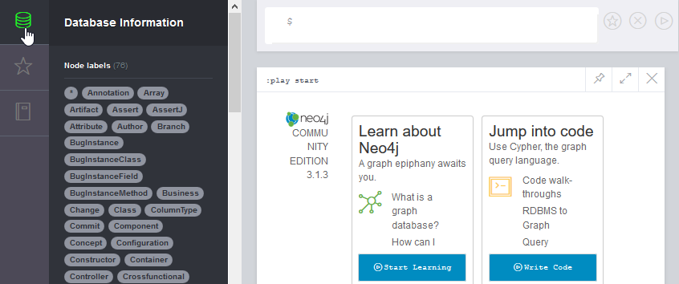

# REFUCTORED Spring PetClinic Sample Application 
see https://github.com/buschmais/spring-petclinic for the forked version of the original

[](https://travis-ci.org/JavaOnAutobahn/spring-petclinic)


# Introduction

This is a Java-based sample application `petclinic` of the Spring Framework to demonstrate the usage of [jQAssistant](https://jqassistant.org/) and [Neo4j](https://neo4j.com/).
Everything is already in place to play around with jQAssistant and Neo4j.
This special version also adds some bad code to have something decent to analyze.

The domain of the application is organizing visits of pet owners to vets in a clinic.

The following steps help you to get started with jQAssistant by describing the installation process step by step.


# Prerequisites


## Minimum requirements

* OpenJDK Java Development Kit with Version >=8 ([download](https://openjdk.java.net/install/))
* Git ([download](https://git-scm.com/downloads))


## Recommended

* To produce nicely looking diagrams, install GraphViz ([download](https://www.graphviz.org/download/))


# Installing and getting to know the sample application


## Optional: Understanding the Spring Petclinic application

* Fly through the presentation on SpeakerDeck: https://speakerdeck.com/michaelisvy/spring-petclinic-sample-application
* Click through the running online web application here: https://stagemonitor-demo.isys-software.de/


# Downloading and running the `petclinic` web application

_Hint: Preferable, you use the Git bash command line or any Unix-like shell for these tasks._


## Local download

Download the source code of the application with Git and build it with Maven (using `mvnw`):
```
git clone https://github.com/JavaOnAutobahn/spring-petclinic.git
cd spring-petclinic
./mvnw verify
```

If this build succeeds, you have downloaded all the necessary dependency locally onto your machine.


## Optional: Running the application locally
 
_Note: Currently only working with JDK 8!_

Start the embedded Tomcat servlet container: 

```
./mvn tomcat7:run
```

Access the `petclinic` web application with your browser here: http://localhost:9966/petclinic/

This is what it looks like:


To shutdown the server, press `Ctrl` + `X` on the command line.


# Running jQAssistant / Neo4j locally

Start jQAssistant with this Maven command:
```
./mvnw jqassistant:server
```
You should see the following on the command line:


You can then access the Neo4j browser frontend with the scanned data here: http://localhost:7474

This is what it should look like after clicking the button in the upper left corner (symbol may differ):



# Next steps

Next, you can click on the various labels in the drawer to explore the scanned software data. You can also use the Neo4j guide for jQAssistant (beta) by executing the following command
```
:play http://guides.neo4j.com/jqassistant
```
or by simply clicking this link: http://localhost:7474/browser?cmd=play&arg=http://guides.neo4j.com/jqassistant. The guide will show you some first steps with jQAssistant/Neo4j.

More information e. g. about the scanned Java code can be found in the documentation of jQAssistant: https://jqassistant.github.io/jqassistant/doc/1.8.0/#_java_plugin .

Have fun!
