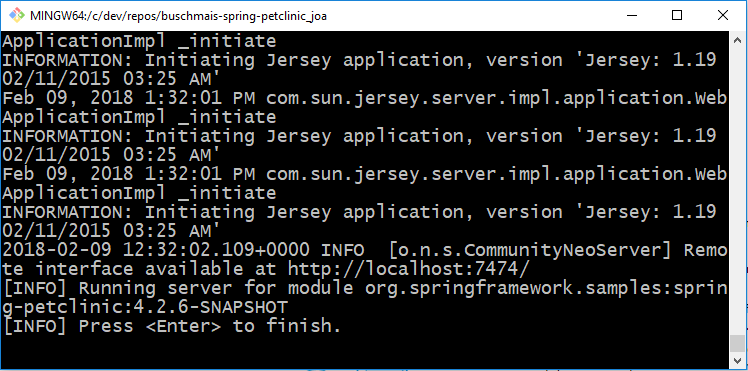
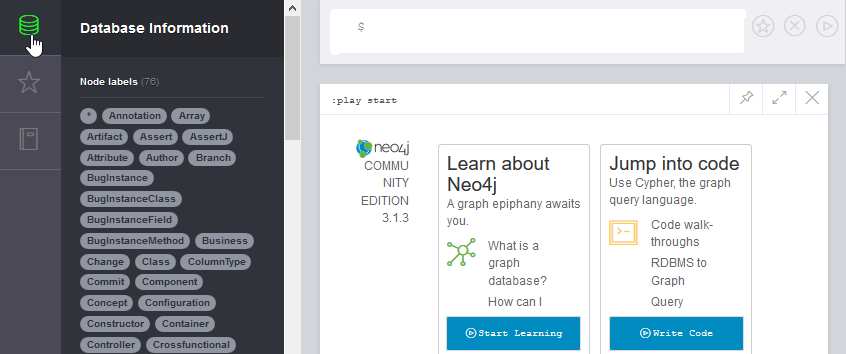
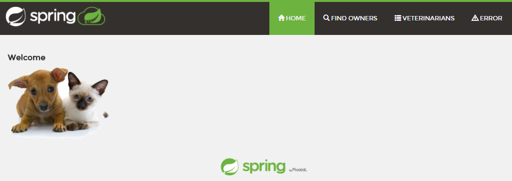

# VERSCHLIMMBESSERTE Spring PetClinic Sample Application 

[](https://travis-ci.org/JavaOnAutobahn/spring-petclinic)


## Einführung

Dies ist die Java-basierte Beispielanwendung `petclinic` des Spring Frameworks, um die Verwendung von [jQAssistant](https://jqassistant.org/) und [Neo4j](https://neo4j.com/) zu demonstrieren.
Es ist hier bereits alles eingebaut, um mit jQAssistant und Neo4j herumzuspielen.
Diese spezielle Version fügt auch etwas schlechten Code hinzu, um etwas Anständiges zum Analysieren zu haben.

Die Domäne der Anwendung ist die Organisation von Tierbesitzern (owners) bei Tierärzten (vets) in einer Tierklinkik (clinic).

Die folgende Anleitung hilft Dir, mit jQAssistant zu beginnen, indem sie den Installationsprozess Schritt für Schritt beschreiben.


## Voraussetzungen


### Mindestanforderungen

* OpenJDK Java Development Kit mit Version >=8 ([Download](https://openjdk.java.net/install/))
* Git ([Download](https://git-scm.com/downloads))


### Empfohlen

* Um gut aussehende Diagramme zu erzeugen, installiere GraphViz ([Download](https://www.graphviz.org/download/))


## Herunterladen und Bauen der Webanwendung

_Hinweis: Vorzugsweise verwendest du für diese Aufgaben die Git-Bash-Kommandozeile oder eine beliebige Unix-ähnliche Shell._


### Lokaler Download

Lade den Quellcode der Anwendung mit Git herunter und baue ihn mit Maven (unter Verwendung von `mvnw`):
```
git clone https://github.com/JavaOnAutobahn/spring-petclinic.git
cd spring-petclinic
./mvnw verify
```

Wenn dieser Build erfolgreich war, hast du alle notwendigen Abhängigkeiten lokal auf deinen Rechner heruntergeladen.


### Lokale Ausführung von jQAssistant / Neo4j

Starte jQAssistant mit diesem Maven-Befehl:
```
./mvnw jqassistant:server
```
Auf der Befehlszeile solltest du in etwa Folgendes sehen:



Hier kannst du dann über das Neo4j Browser-Frontend auf die gescannten Daten zugreifen: http://localhost:7474

So sollte es nach dem Anklicken der Schaltfläche in der linken oberen Ecke aussehen (das Symbol könnte etwas abweichen):



**Damit ist die Installation abgeschlossen!**


## Optional: Kennenlernen der Beispielanwendung

* Überfliege die Präsentation auf SpeakerDeck: https://speakerdeck.com/michaelisvy/spring-petclinic-sample-application


## Optional: Lokale Ausführung der Anwendung
 
_Beachte: Funktioniert derzeit nur mit JDK 8!_

Starten Sie den eingebetteten Tomcat-Servlet-Container: 

```
./mvn tomcat7:run
```

Greife hier mit deinem Browser auf die Webanwendung zu: http://localhost:9966/petclinic/

So sollte in etwa aussehen.:



Um den Server herunterzufahren, drücke `Strg` + `X` oder `Strg` + `C` auf der Kommandozeile.


## Optional: Nächste Schritte

Als nächstes kannst du auf die verschiedenen Buttons in der Schublade (links) klicken, um die gescannten Softwaredaten zu untersuchen.

Du kannst auch einen Neo4j-Guide für jQAssistant (beta) verwenden, indem du den folgenden Befehl ausführst
```
:play http://guides.neo4j.com/jqassistant
```
oder indem du einfach auf diesen Link klickst: http://localhost:7474/browser?cmd=play&arg=http://guides.neo4j.com/jqassistant.
Der Leitfaden wird dir einige erste Schritte mit jQAssistant/Neo4j zeigen.

Weitere Informationen z. B. über den gescannten Java-Code findest du in der Dokumentation von jQAssistant: https://jqassistant.github.io/jqassistant/doc/1.8.0/#_java_plugin .

Viel Spaß!
